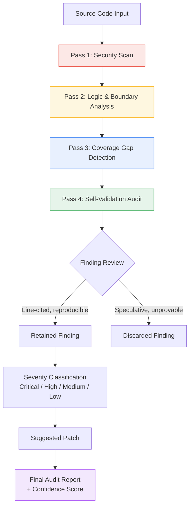

<div align="center">

# CodeSentinel

### Multi-Pass Agentic Code Reviewer

Autonomous, self-validating code auditor — security scan, logic analysis, coverage gaps, and a self-critique pass that filters speculation from confirmed defects.

[](https://codesentinel-29463310253.asia-southeast1.run.app/)
[](https://cloud.google.com/run)
[](https://github.com/langchain-ai/langchain/issues/38850)
[](#license)

[Live Demo](https://codesentinel-29463310253.asia-southeast1.run.app/) · [Report Bug](../../issues) · [AgentTrust](https://github.com/Shital24650/agenttrust)

</div>

---

## Overview

Most AI code reviewers generate a list of findings and stop there. **CodeSentinel adds a fifth step most tools skip: it audits its own output.** After three passes of analysis, a fourth pass re-examines every finding and discards anything that isn't tied to a specific, verifiable line of code — filtering speculative "best practice" noise from confirmed, exploitable defects.

Built on the reliability principles established in [AgentTrust](https://github.com/Shital24650/agenttrust), CodeSentinel is that methodology applied to a real, practical use case: reviewing unfamiliar, production-grade code with the discipline to know what it doesn't actually know.

## Architecture



**Execution flow:** submitted code runs through three independent analysis passes — security vulnerabilities, logic/boundary conditions, and untested coverage gaps — each producing raw candidate findings. Pass 4 is the differentiator: it re-reviews every finding from Passes 1–3 against a single test — *is this tied to an identifiable line of code with a reproducible failure mode, or is it a stylistic/architectural opinion?* Findings that fail this test are explicitly logged as discarded, with the reasoning shown. Only what survives gets a severity rating, a suggested patch, and a place in the final report.

## Why the Self-Validation Pass Matters

Most static analysis output is noisy — flooding developers with low-confidence findings that erode trust in the tool. CodeSentinel's Pass 4 is designed to fix that by being honest about uncertainty. Real examples from validated test runs:

| Run Target | Findings Raised (Passes 1–3) | Retained After Self-Validation | Confidence |
|---|---|---|---|
| Demo snippet (SQLi/eval/KeyError) | 9 | 5 | 71% |
| NetBox `base.py` (13k★ production repo) | 9 | 7 | 78% |
| LangChain Core `runnables/utils.py` | 8 | 4 | 50% |

A finding surviving Pass 4 isn't a guess — it's line-cited, reproducible, and stripped of speculation the tool itself flagged and removed.

## Verified Findings

CodeSentinel has been tested against real, actively-maintained production codebases — not curated demo snippets — with every finding independently reproduced before being reported.

**LangChain Core — filed upstream: [Issue #38850](https://github.com/langchain-ai/langchain/issues/38850)**
Identified a silent data-loss bug in `AddableDict.__add__`/`__radd__` (`langchain_core/runnables/utils.py`), used internally in `RunnablePassthrough` and LCEL's streaming/chunk-aggregation path. Type-incompatible merges silently discard the left-hand value with no error or warning. Reproduced independently against the live installed package (`langchain_core 1.4.9`) before filing.

**NetBox (13,000★ production repo)**
Identified a type-safety bug in `GetRelatedModelsMixin.get_related_models()`: string identifiers (UUID/slug) passed as the `instance` argument are treated as an `Iterable` and silently split into individual characters, corrupting the resulting query filter.

## Analysis Categories

| Pass | Focus |
|---|---|
| **1. Security Scan** | Injection vectors, unsafe standard functions (`eval`, `pickle`), exposed credentials, input validation gaps |
| **2. Logic & Boundary Analysis** | Type mismatches, unhandled exceptions, race conditions, off-by-one and null-reference risks |
| **3. Coverage Gap Detection** | Untested execution paths, missing exception branches, edge cases with no corresponding test case |
| **4. Self-Validation Audit** | Cross-examines Passes 1–3, discards speculative or unreproducible findings, assigns a confidence score |

## Tech Stack

- React frontend, calling the Anthropic API directly — no backend server required
- Deployed on **Google Cloud Run** (`asia-southeast1`)
- Multi-pass prompt orchestration built on [AgentTrust](https://github.com/Shital24650/agenttrust) reliability principles

## Getting Started

```bash
git clone https://github.com/Shital24650/codesentinel.git
cd codesentinel
npm install
npm run dev
```

Set your Anthropic API key as an environment variable before running:

```
ANTHROPIC_API_KEY=your_key_here
```

## Roadmap

- [ ] Expand test coverage to a third production codebase in a different language ecosystem
- [ ] Add a public results archive of all validated runs
- [ ] Support multi-file / cross-file analysis
- [ ] Publish methodology writeup alongside AgentTrust's

## Live Demo

**[codesentinel-29463310253.asia-southeast1.run.app →](https://codesentinel-29463310253.asia-southeast1.run.app/)**

## License

MIT

---

<div align="center">
Built by <a href="https://github.com/Shital24650">Shital Parab</a> — part of a two-project reliability pairing with <a href="https://github.com/Shital24650/agenttrust">AgentTrust</a>, the benchmark that defines the reliability standard CodeSentinel is built to meet.
</div>
